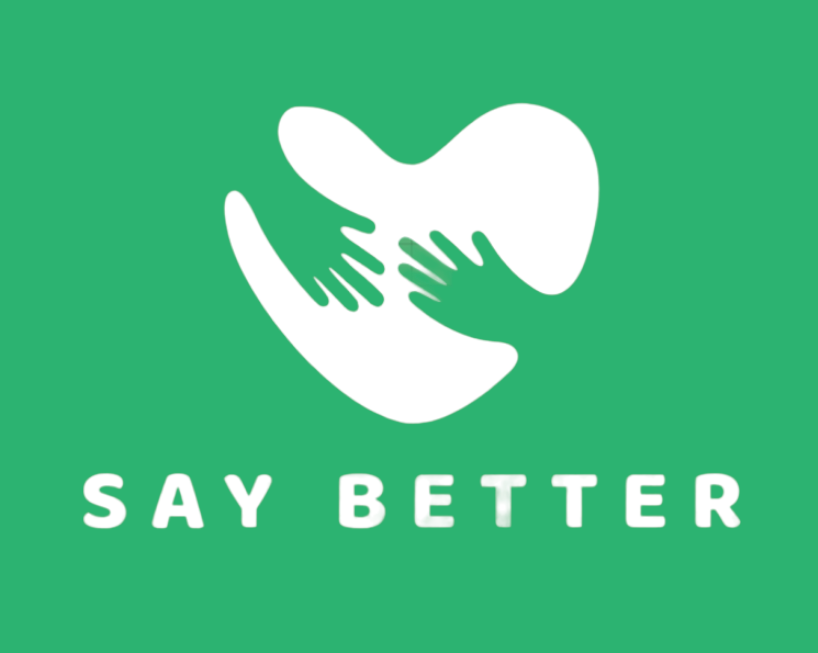
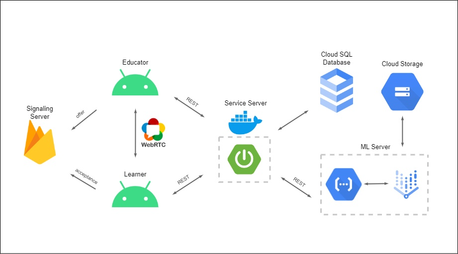
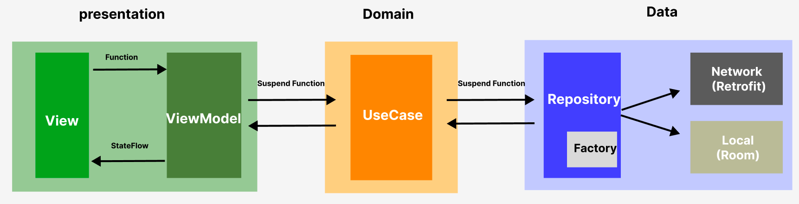

# <center>Say Better-Android Repo</center>

<br>
<p align="center">

</p>


</br>

<br>

## System Architecture
<p align="center">

</p>
</br>


<br>

## App Architecture
<p align="center">

</p>
</br>


<br>

## File-Tree
```
📦 Android

├─ app
│  └─ src
│     └─ main
│        ├─ AndroidManifest.xml
│        ├─ java
│        │  └─ gdsc
│        │     └─ solutionchallenge
│        │        └─ saybetter
│        │           ├─ SayBetterApplication.kt
│        │           └─ di
│        │              ├─ AppModule.kt
│        │              └─ Interceptors.kt
│        └─ res
│           └─ drawable
├─ data
│  └─ src
│     └─ main
│        ├─ AndroidManifest.xml
│        └─ java
│           └─ gdsc
│              └─ solutionchallenge
│                 └─ saybetter
│                    └─ data
│                       ├─ api
│                       ├─ di
│                       ├─ internal
│                       ├─ mapper
│                       ├─ parameter
│                       ├─ repository
│                       ├─ response
│                       └─ source
├─ data
│  ├─ build.gradle.kt
│  └─ src
│     └─ main
│        └─ java
│           └─ gdsc
│              └─ solutionchallenge
│                 └─ saybetter
│                    └─ domain
│                       ├─ entity
│                       ├─ repository
│                       └─ usecase
└─ presentation
   └─ src
      └─ main
         ├─ AndroidManifest.xml
         ├─ java
         │  └─ gdsc
         │     └─ solutionchallenge
         │        └─ saybetter
         │           ├─ base
         │           └─ presentation
         │              ├─ component
         │              │  └─ type
         │              ├─ firebase
         │              ├─ model
         │              ├─ theme
         │              ├─ ui
         │              │  ├─ home
         │              │  ├─ leaner
         │              │  ├─ login
         │              │  ├─ main
         │              │  ├─ my
         │              │  ├─ solution
         │              │  │  ├─ creat
         │              │  │  ├─ progres
         │              │  │  ├─ review
         │              │  │  └─ storage
         │              │  └─ splash
         │              └─ util
         └─ res
            ├─ drawable
            └─ values
```

</br>


<br>

## Skills
- 100 % Jetpack Compose
  </br>